# Model Observability Incident Platform

[](https://github.com/kevinmeix1/model-observability-incident-platform/actions/workflows/ci.yml)

A local-first, production-style reliability control plane that evaluates model
telemetry, opens durable incidents, freezes unsafe releases, and records
recovery evidence. Version `0.3.0` also proves reliable incident notification
delivery through a transactional CloudEvents outbox.

This is a portfolio project, not a production service. It uses deterministic
synthetic telemetry and a single-process SQLite runtime so its correctness and
failure behavior can be reviewed without cloud credentials.


[Watch the narrated judge demo](docs/demo/model-observability-judge-demo.mp4) | [Follow the live demo script](docs/judge-demo.md)

For a study-oriented walkthrough with the full architecture diagram,
step-by-step screenshot guide, code reading order, and interview explanations,
start with [the project study guide](docs/study-guide.md).

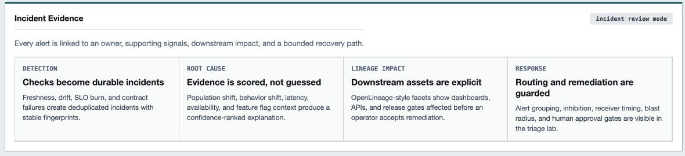

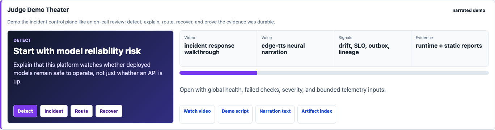

## What Is Executable

| Capability | Local evidence | Integrated evidence | Production mapping |
| --- | --- | --- | --- |
| Drift and serving checks | Deterministic reference/current windows and six check types | FastAPI accepts bounded telemetry windows | Warehouse or stream telemetry consumers |
| Incident state | SQLite WAL transaction with incidents, evaluations, and immutable events | Restart-safe HTTP idempotency smoke | Postgres with retention and HA |
| Incident lifecycle | Open, acknowledge, resolve, reopen, and recovery hysteresis | Optimistic version and transition-key tests | On-call authorization and ticket integration |
| RCA evidence | SLO burn, lineage facets, feature-flag context, and confidence scoring | Dashboard evidence panel plus `root_cause_evidence_bundle.json` | Incident-review evidence store and OpenLineage backend |
| Alert routing and remediation | Alertmanager-style grouping, inhibition, escalation, and approval gates | Dashboard panel plus `alert_routing_remediation_plan.json` | Alertmanager, PagerDuty, Slack, Argo Rollouts, and approval workflow |
| Interactive incident lab | Browser-tested degradation, acknowledgement, and two-window recovery | Live FastAPI state plus a draining worker | Authenticated operator console and escalation service |
| Notification delivery | Atomic CloudEvents outbox, ordered leases, retries, and DLQ | Crash recovery and idempotent receiver contract | Postgres relay plus Kafka/SQS and ticket routing |
| Metrics | Dedicated Prometheus registry with bounded labels | `/metrics` is checked over HTTP | Managed Prometheus and recording rules |
| Traces | Manual OpenTelemetry server/evaluation spans | W3C `traceparent` propagation test | OTLP collector and trace backend |
| API image | Non-root, read-only filesystem, body and concurrency limits | Compose health and behavior smoke in CI | Kubernetes Deployment and managed database |
| Airflow | Airflow 3.3 stateful incident DAG and validator | Real Airflow 3.3 SDK parse job in CI | Scheduler, workers, and remote DAG bundles |
| Kubernetes | Versioned manifests and decision reports | Static contract tests | Minikube or managed-cluster deployment work |

An image, dependency, or manifest is not counted as an integration merely
because it exists in the repository.

## Architecture

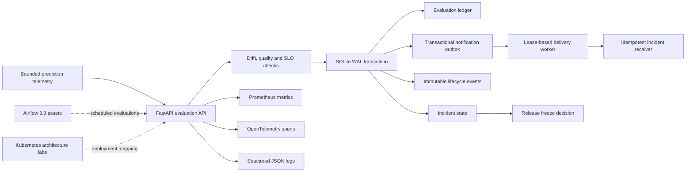

Solid lines are exercised locally or in the container smoke. Dashed lines are
integration designs and SDK/manifests, not a claim of a running cluster.

## Quick Start

The dependency-free deterministic demo still works with the standard library:

```bash
make demo
make test
open .local/reports/model_observability_dashboard.html
open .local/reports/judge_demo_cockpit.html
open .local/reports/operator_drill_lab.html
open .local/reports/reliability_signal_mesh.html
open .local/reports/narrated_demo_studio.html
```

The judge demo cockpit links the incident dashboard, narrated video,
operational readiness packet, and generated evidence artifacts behind
interactive release, observability, governance, and operator-handoff filters.

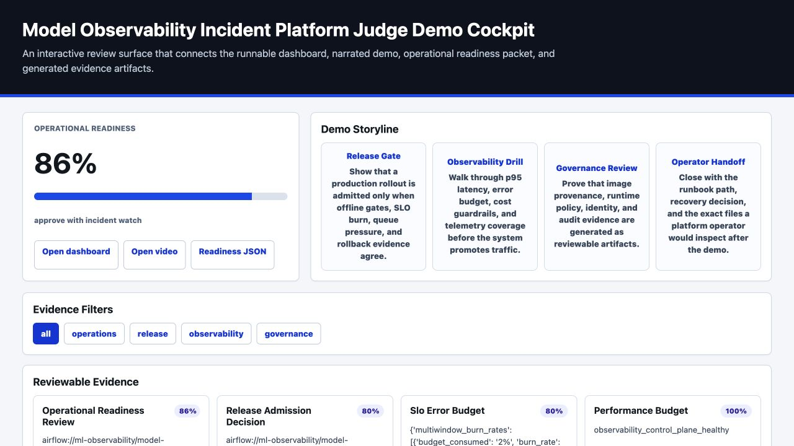

The Operator Drill Lab rehearses detection, triage, containment, recovery, and
blameless postmortem follow-up from the generated incident evidence.

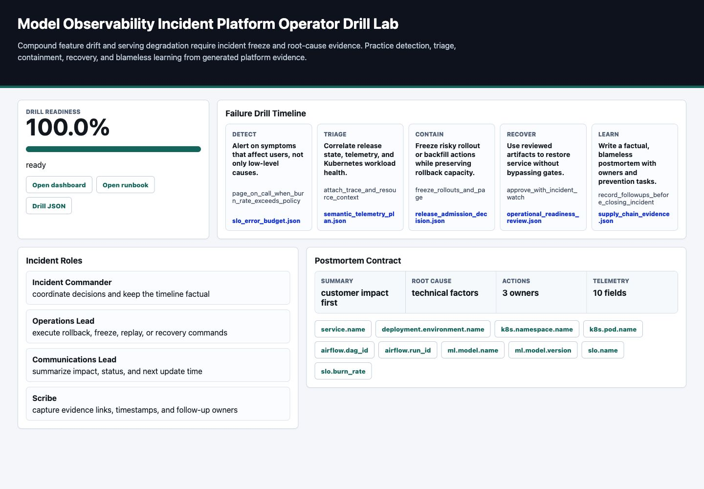

The Reliability Signal Mesh connects Airflow asset events, OpenTelemetry
resource attributes, Kueue admission pressure, SLO burn, and fail-closed release
decisions into one operator-facing evidence graph.

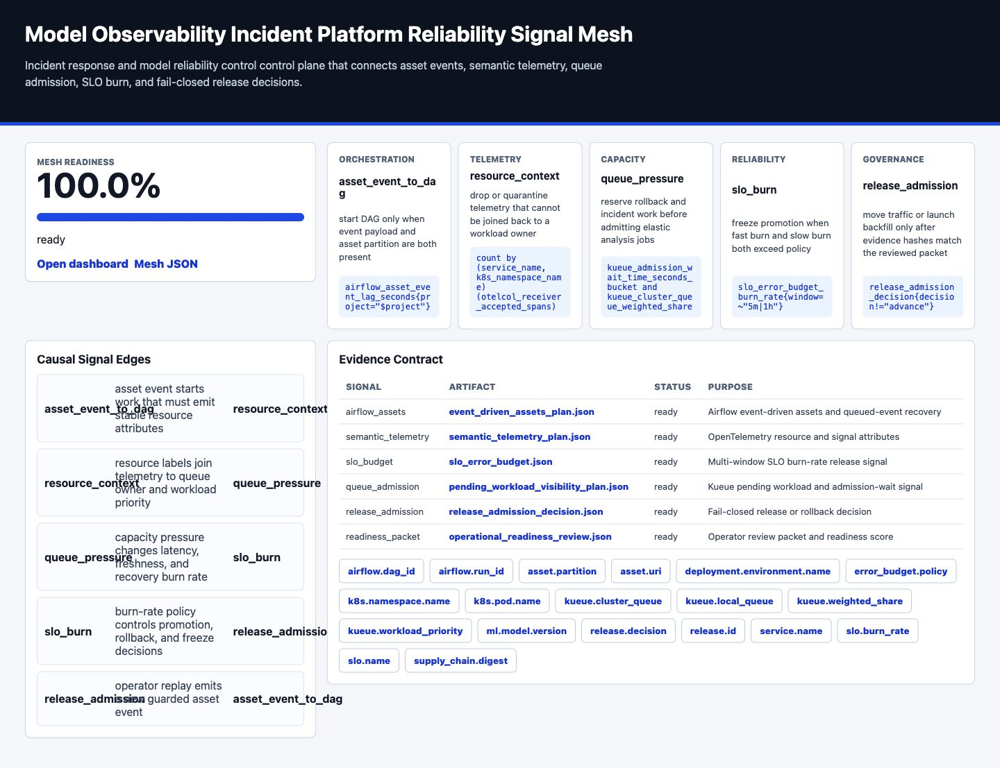

The Narrated Demo Studio turns the evidence bundle into a judge-facing chapter
timeline with natural voice backends, Remotion props, subtitle timing, and
evidence-linked visuals.

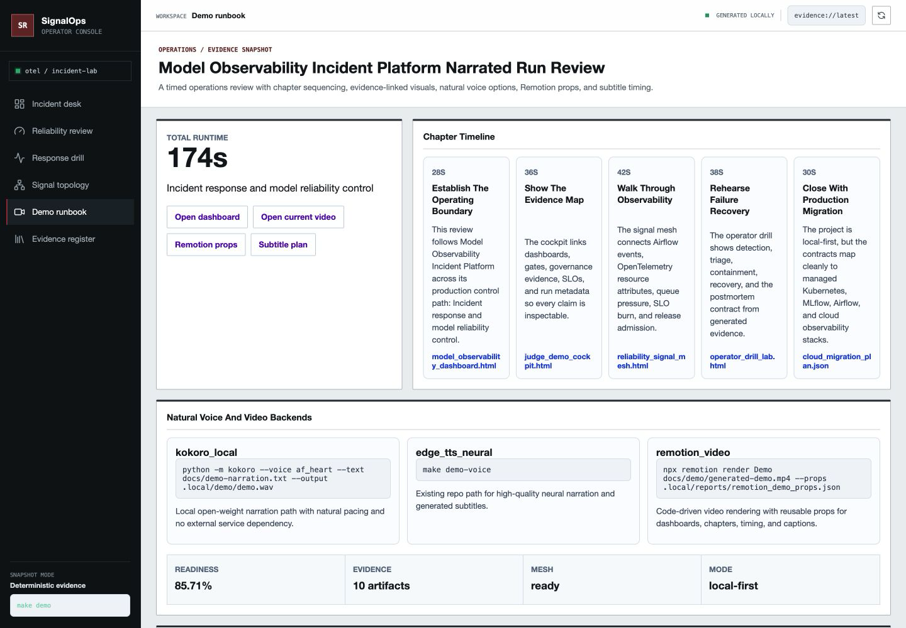

Exercise the actual HTTP runtime with Python 3.12:

```bash
python3.12 -m venv .venv
.venv/bin/python -m pip install --upgrade "pip==25.3"
.venv/bin/python -m pip install \
  --constraint requirements-observability.lock \
  "build==1.5.1" "setuptools==83.0.0" "wheel==0.47.0"
.venv/bin/python -m pip install \
  --no-build-isolation \
  --constraint requirements-observability.lock \
  --editable ".[runtime,test,dev]"

make verify-observability-lock PYTHON=.venv/bin/python
make test PYTHON=.venv/bin/python
make runtime-contract PYTHON=.venv/bin/python
make notification-outbox-contract PYTHON=.venv/bin/python
make dashboard PYTHON=.venv/bin/python
```

Start the API at `http://127.0.0.1:8081`:

```bash
make api-run PYTHON=.venv/bin/python
```

In a second terminal, run the durable delivery worker:

```bash
PYTHONPATH=src .venv/bin/python -m model_observability_platform.notification_worker \
  --state-root .local --worker-id local-demo-worker --poll-seconds 0.5
```

Open `http://127.0.0.1:8081/dashboard`. The Live Incident Response Lab submits
real bounded telemetry to the API. `Run evaluation` freezes the release and
updates four stable incident fingerprints; each lifecycle event commits with a
CloudEvent outbox row. `Send 2-window recovery` exercises policy hysteresis,
resolves the incidents, and returns the release decision to `CONTINUE`.

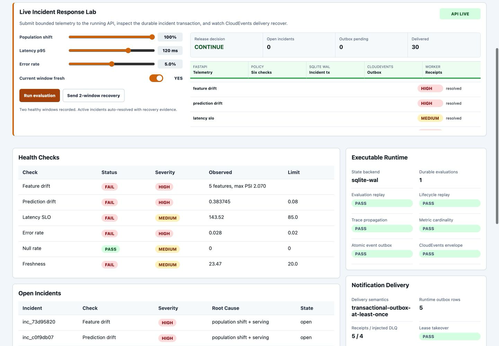

Useful endpoints:

- `POST /v1/evaluations`
- `GET /v1/incidents`
- `POST /v1/incidents/{id}/acknowledge`
- `POST /v1/incidents/{id}/resolve`
- `GET /v1/incidents/{id}/events`
- `GET /v1/notifications`
- `GET /v1/notifications/{event_id}/attempts`
- `GET /v1/runtime`
- `GET /health/ready`
- `GET /metrics`
- `GET /docs`

## Container Path

```bash
make compose-config
make compose-smoke PYTHON=.venv/bin/python
```

The Compose topology uses a finite state initialization job, a health-gated
control-plane service, a named state volume, an optional Prometheus profile,
and an optional delivery worker. The smoke starts both API and worker, then
waits until pending and in-flight notification counts reach zero.
The application runs as UID/GID 65532 with dropped capabilities, no privilege
escalation, a read-only root filesystem, bounded memory/CPU/PIDs, and graceful
termination.

Prometheus is optional:

```bash
make compose-observability-up
```

Run the API with the local idempotent delivery sink:

```bash
make compose-delivery-up
```

The runtime deliberately uses one Uvicorn worker. In-memory metric aggregation
and SQLite write serialization would make a multi-worker claim misleading.

## Incident Semantics

### Evaluation idempotency

`evaluation_id` is stored with a canonical request hash. Replaying the same ID
and payload returns the original decision without incrementing incidents. Reuse
with a different payload returns HTTP 409.

### Stable deduplication

An incident fingerprint contains model name, model version, policy version, and
check name. Observed values are evidence, not identity. Repeated failures update
one incident and increment its occurrence count.

### Lifecycle concurrency

Acknowledgement and resolution require an expected incident version and a
transition idempotency key. A stale version or reused key with a different
payload returns HTTP 409. Every accepted state change appends an audit event.

### Recovery hysteresis

One healthy window records recovery evidence. Two consecutive healthy windows
auto-resolve an active incident by default. A later failed window reopens it.
High or critical active incidents produce a release-freeze decision.

### Root-cause evidence

The RCA bundle explains the selected likely root cause without changing incident
dedupe identity. It attaches symptom-first SLO burn evidence, OpenLineage-style
facets, rollout feature-flag context, confidence, and missing evidence to
`reports/root_cause_evidence_bundle.json` and the dashboard.

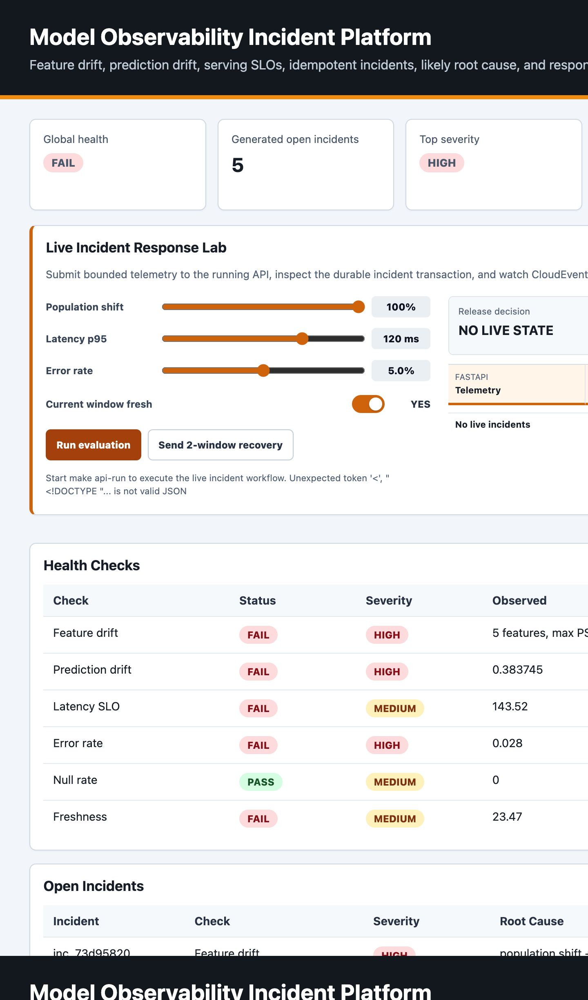

### Alert routing and guarded remediation

The alert routing plan models Alertmanager grouping, inhibition, escalation, and receiver routing before the transactional outbox sees an incident event. It also classifies remediation actions by blast radius: rollout freezes and diagnostic fanout are automatic, while resource-increasing diagnostic scaling requires human approval. The dashboard includes an interactive triage lab so a reviewer can choose an alert group, see which symptoms are suppressed, inspect receiver timing, and trace the OpenLineage column-impact path before accepting the remediation. See [alert routing and guarded remediation](docs/alert-routing-remediation.md).

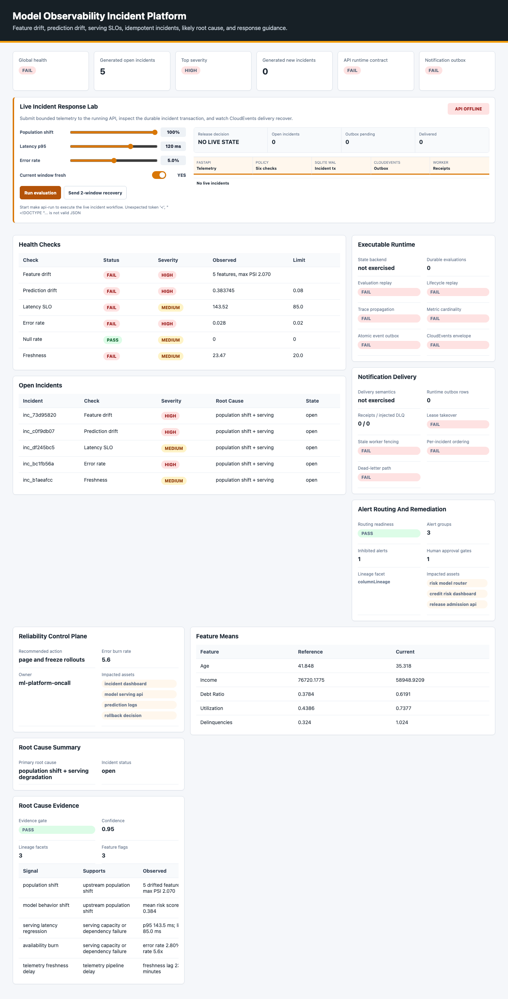

Mobile capture: [dashboard-alert-routing-remediation-mobile.png](docs/screenshots/dashboard-alert-routing-remediation-mobile.png)

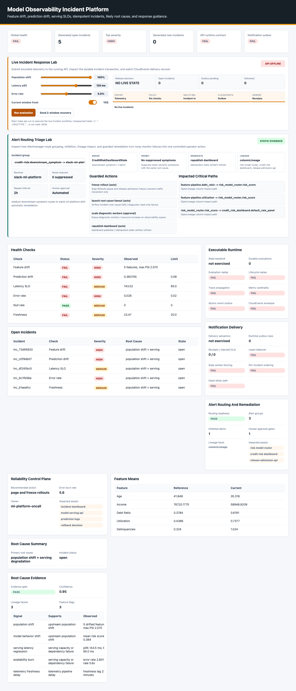

Mobile triage capture: [dashboard-alert-routing-triage-mobile.png](docs/screenshots/dashboard-alert-routing-triage-mobile.png)

### Transactional notifications

Each incident event and its CloudEvent notification commit in the same SQLite
transaction. Workers claim disjoint due rows under expiring leases, preserve
order per incident, persist attempt outcomes, apply capped exponential backoff,
and dead-letter exhausted deliveries. A recovered worker cannot complete a
lease after another owner has taken it.

Delivery is explicitly at least once. The local receipt sink proves that a
receiver can deduplicate the same event ID and reject an ID reused with another
payload. See the [transactional notification outbox](docs/transactional-notification-outbox.md)
for the executed contract and production migration.

## Checks

| Check | Signal | Demo threshold |
| --- | --- | ---: |
| Feature drift | Mean shifts and PSI across five features | PSI `>= 0.20` or feature-specific delta |
| Prediction drift | Current versus reference mean score | Absolute delta `> 0.08` |
| Latency SLO | Current p95 and p99 | p95 `> 85 ms` |
| Error rate | Non-success telemetry | `> 2%` |
| Null rate | Missing monitored feature values | Any missing value |
| Freshness | Age of newest current telemetry | `> 20 minutes` |

These values make the scenario deterministic. They are policy examples, not
validated thresholds for a real credit-risk model.

## Observability Contract

The API emits:

- low-cardinality counters, gauges, and histograms under the
  `model_observability_` prefix
- HTTP server spans named from route templates, never raw incident IDs
- a nested `model_observability.evaluate` span
- W3C trace propagation through `traceparent`
- JSON logs with request and trace IDs, route, status, duration, and bounded
  outcome fields

Evaluation IDs, request IDs, incident IDs, model versions, raw features, and
telemetry records are intentionally excluded from metric labels. Raw features
and request bodies are also excluded from logs and spans.

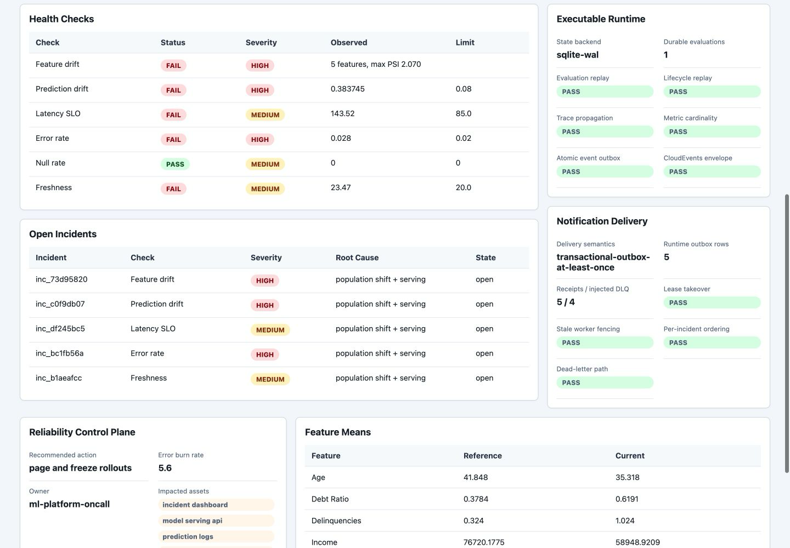

## Airflow And Kubernetes Scope

The repository includes a real Airflow 3.3 SDK parse contract for stateful
incident orchestration. It also contains architecture labs for Kueue admission,
multi-cluster dispatch, Dynamic Resource Allocation, workload identity,
progressive delivery, resource controls, chaos, and policy enforcement.

Those assets demonstrate design judgment and are grouped in the generated
artifact index. They are not all deployed together, and several target recent
or preview Kubernetes capabilities that require explicit feature-gate and
version checks.

The orchestration design follows Airflow 3's public SDK, asset-aware scheduling,
and event-driven scheduling model. The telemetry contract follows OpenTelemetry
semantic conventions, including low-cardinality HTTP route templates. These are
design inputs, not substitutes for the executable contracts in this repository:

- [Airflow asset-aware scheduling](https://airflow.apache.org/docs/apache-airflow/stable/authoring-and-scheduling/asset-scheduling.html)
- [Airflow event-driven scheduling](https://airflow.apache.org/docs/apache-airflow/stable/authoring-and-scheduling/event-scheduling.html)
- [OpenTelemetry semantic conventions](https://opentelemetry.io/docs/specs/semconv/)
- [CloudEvents](https://cloudevents.io/)
- [Kubernetes disruption guidance](https://kubernetes.io/docs/concepts/workloads/pods/disruptions/)

Start with these documents:

- [Executable observability runtime](docs/executable-observability-runtime.md)
- [Transactional notification outbox](docs/transactional-notification-outbox.md)
- [Runtime incident recovery runbook](docs/runbooks/runtime-incident-recovery.md)
- [Airflow 3.3 stateful orchestration](docs/airflow-stateful-orchestration.md)
- [AI workload telemetry readiness](docs/ai-workload-telemetry.md)
- [Operational readiness review](docs/operational-readiness-review.md)
- [Semantic telemetry contract](docs/semantic-telemetry.md)
- [Release admission control](docs/release-admission-control.md)
- [Kubernetes and Airflow robustness](docs/kubernetes-airflow-robustness.md)

## Commands

| Command | Evidence produced |
| --- | --- |
| `make demo` | Dependency-free telemetry, incidents, plans, reports, and dashboard |
| `make demo-voice demo-video` | Neural narration and H.264/AAC judge walkthrough |
| `make test` | Legacy deterministic domain and manifest contracts |
| `make test-api` | API, state, trace, metric, and lifecycle tests |
| `make runtime-contract` | In-process end-to-end HTTP evidence JSON |
| `make notification-outbox-contract` | Lease crash, retry, ordering, receiver replay, and DLQ evidence |
| `make api-smoke` | The same contract against a running API |
| `make lint-runtime` | Ruff checks for the executable runtime boundary |
| `make verify-observability-lock` | Exact installed-distribution audit against the flat lock |
| `make package package-smoke` | Isolated `0.3.0` wheel build and import/version proof |
| `make dashboard` | Dashboard rebuilt from current static and runtime evidence |
| `make airflow-sdk-contract` | Airflow 3.3 DAG parse and task contract |
| `make compose-smoke` | Container build, readiness, and real HTTP behavior |
| `make compose-delivery-up` | API plus durable notification worker and local receipt sink |
| `make ci-verify` | Generated dependency-free artifact inventory |

## Test Evidence

The runtime suite proves:

- point-in-time freshness uses an injected, timezone-aware clock
- evaluation replay survives application restart
- stable fingerprints update evidence without duplicate incidents
- transition keys are idempotent and incident versions are optimistic
- two healthy windows resolve an incident and later failures can reopen it
- request schemas, record counts, model versions, and body sizes are bounded
- W3C traces preserve the incoming trace ID and use low-cardinality routes
- Prometheus output does not contain evaluation, request, or model-version IDs
- incident and notification records commit atomically
- concurrent notification claims are disjoint and ordered per incident
- expired leases are recoverable while stale workers are fenced
- retry, dead-letter, and immutable attempt histories survive process restart
- a downstream receiver handles at-least-once duplicate delivery idempotently
- additive schema version 1 migration succeeds and unknown future versions fail closed

CI separates the dependency-free demonstration, Airflow 3.3 SDK parse, and
executable runtime/container contract so each claim has a visible gate.

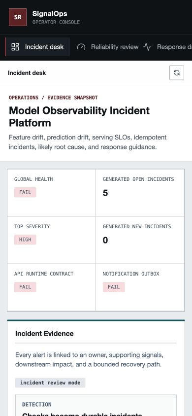

## Production Boundary

Before operating this as a real service, it would need:

- authenticated callers and role-based incident transitions
- Postgres or another HA transactional store with migrations and retention
- tenant isolation and per-model policy ownership
- streaming or warehouse ingestion rather than request-carried windows
- calibrated thresholds, delayed-label evaluation, and business SLOs
- a highly available outbox relay, broker, escalation policy, and ticket reconciliation
- multi-replica metric aggregation and safe leader or worker coordination
- privacy review, deletion policy, audit retention, backups, and restore drills
- load, soak, failure, and adversarial testing with representative telemetry

The local SQLite boundary is intentional: it makes transaction and recovery
semantics inspectable without pretending to solve distributed consensus.

## Interview Talking Points

- Why observed values must not be part of an incident deduplication key.
- Where the evaluation, incident update, and audit event transaction begins and
  ends.
- Why idempotency keys and optimistic versions solve different retry problems.
- Why a transactional outbox removes the database/webhook dual-write window but
  still requires an idempotent consumer.
- How leases, per-incident ordering, stale-worker fencing, and dead letters
  interact under at-least-once delivery.
- Why recovery requires multiple healthy windows rather than one green sample.
- How metric cardinality and trace route naming affect observability cost.
- Why a single-worker SQLite deployment is honest locally but not horizontally
  scalable.
- Which Airflow/Kubernetes assets are executed, parsed, statically tested, or
  design-only.
