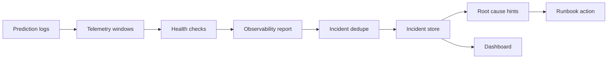

# Model Observability + Incident Response Platform

[](https://github.com/kevinmeix1/model-observability-incident-platform/actions/workflows/ci.yml)

A production-style model reliability project that detects feature drift, prediction drift, serving SLO failures, freshness issues, and data quality problems, then creates idempotent incidents with severity, likely root cause, and next action guidance.

The default demo is local-first and dependency-light. The design maps cleanly to Evidently, Prometheus, OpenTelemetry, Grafana, PagerDuty, and warehouse-backed model monitoring.


## What This Demonstrates

- Reference and current telemetry windows
- Feature drift checks
- Prediction distribution drift checks
- Latency p95 and p99 tracking
- Error rate monitoring
- Freshness checks
- Data quality checks
- Idempotent incident creation
- Severity classification
- Likely root-cause hints
- Runbook-oriented next actions
- Dashboard for health checks, incidents, and feature shifts

## Architecture



## Quick Start

```bash
make demo
make test
```

Open the generated dashboard:

```bash
open .local/reports/model_observability_dashboard.html
```

## Checks

- `feature_drift`: compares current feature means to reference means
- `feature_drift PSI`: compares distribution shift across reference quantile buckets
- `prediction_drift`: compares current and reference score means
- `latency_slo`: validates p95 latency
- `error_rate`: validates serving failure rate
- `null_rate`: checks malformed telemetry
- `freshness`: checks telemetry recency

## Production-Grade Refinements

See [production-grade refinements](docs/production-grade-refinements.md) for the PSI drift, SLO, incident dedupe, root-cause, and runbook improvements.

For the latest reliability control-plane pass, see [advanced orchestration assessment](docs/advanced-orchestration-assessment.md).

For the Kubernetes/Airflow robustness layer, see [Kubernetes and Airflow robustness](docs/kubernetes-airflow-robustness.md).

For the operator-facing reliability planner, see [advanced reliability control plane](docs/control-plane-depth.md).

For the policy-as-code audit layer, see [security and governance](docs/security-governance.md).

For OpenTelemetry-style runtime traces, see [observability and tracing](docs/observability-tracing.md).

For controlled failure injection and recovery objectives, see [resilience and chaos drills](docs/resilience-chaos.md).

For workload right-sizing, HPA/VPA guardrails, and Airflow pool sizing, see [resource optimization](docs/resource-optimization.md).

For runtime network boundaries, mTLS, and allow-listed service flows, see [network security](docs/network-security.md).

For auditable environment promotion with Argo CD and Argo Rollouts, see [GitOps promotion](docs/gitops-promotion.md).

For backup schedules, restore order, and RPO/RTO evidence, see [disaster recovery](docs/disaster-recovery.md).

For reliability system cards, telemetry data cards, incident approval records, risk controls, and reproducibility hashes, see [governance evidence](docs/governance-evidence.md).

For model reliability SLOs, burn-rate alerts, and rollout-freeze automation, see [SLO and error budget automation](docs/slo-error-budget.md).

For EKS Auto Mode, Terraform, managed-service mappings, and portability notes, see [cloud migration](docs/cloud-migration.md).

For GitHub artifact attestations, SLSA provenance, Sigstore policy-controller admission, and checksum evidence, see [supply chain provenance](docs/supply-chain-provenance.md).

For an automated scan of advanced Airflow, Kubernetes, lineage, scaling, GitOps, and security controls, see [orchestration scorecard](docs/orchestration-scorecard.md).

For GPU ResourceFlavors, Dynamic Resource Allocation notes, MIG/time-slicing trade-offs, and accelerator quota planning, see [accelerator scheduling](docs/accelerator-scheduling.md).

For concrete DRA ResourceClaimTemplates, Kueue-coupled diagnostic admission, and CPU incident fallbacks, see [dynamic resource allocation](docs/dynamic-resource-allocation.md).

For Kubernetes v1.36 DRA `ResourceHealthStatus`, `ResourceClaim.status.devices`, and device quarantine during drift diagnostics, see [DRA resource health status](docs/dra-resource-health-status.md).

For DRA prioritized alternatives, partitionable devices, consumable capacity, and binding-condition readiness for diagnostics, see [DRA advanced device sharing](docs/dra-advanced-device-sharing.md).

For Kubernetes v1.36 DRA `AdminAccess` diagnostics with incident linkage, evidence-quality metadata, and rollout-freeze guardrails, see [Observability DRA AdminAccess diagnostics](docs/dra-admin-access-diagnostics.md).

For Kubernetes v1.35 in-place Pod Resize, v1.36 pod-level resource resizing, incident-safe monitor bursts, and VPA `InPlaceOrRecreate` guardrails, see [observability in-place Pod resize controls](docs/inplace-pod-resize.md).

For Kueue topology-aware diagnostics, telemetry collector spread, and incident-safe placement fallbacks, see [topology-aware scheduling](docs/topology-aware-scheduling.md).

For KubeRay incident fanout, Kueue priority queues, optional GPU drift diagnostics, and rollout-freeze fallbacks, see [KubeRay and Kueue](docs/kuberay-kueue.md).

For Kueue Workload Slices, JobSet incident fanout, drift-backlog replacement slices, GPU diagnostics, and rollout-freeze capacity recovery, see [Kueue elastic workloads](docs/kueue-elastic-workloads.md).

For Kubernetes Indexed Jobs, per-index retry budgets, `successPolicy`, `podFailurePolicy`, and Airflow 3 failed-only incident recovery, see [indexed job resilience](docs/indexed-job-resilience.md).

For Kueue ProvisioningRequest admission checks that protect incident diagnostics, rollback-freeze checks, and GPU drift probes, see [provisioning admission](docs/provisioning-admission.md).

For Kueue MultiKueue cross-cluster incident dispatch, worker status sync, repair automation freeze semantics, and GPU diagnostic fallback, see [MultiKueue incident dispatch](docs/multikueue-dispatch.md).

For Kubernetes image-volume incident evidence mounts, digest-pinned reference windows, policy bundles, golden incidents, runbooks, and object-store fallback semantics, see [incident evidence volumes](docs/incident-evidence-volumes.md).

For Kubernetes pod-level resource envelopes, stable scheduling gates, incident evidence readiness, policy digest checks, and scheduler-churn metrics, see [pod resource envelopes](docs/pod-resource-envelopes.md).

For Kueue Fair Sharing, Admission Fair Sharing, incident queue weights, borrowing/lending limits, and preemption guardrails, see [Kueue cohort fair sharing](docs/kueue-cohort-fair-sharing.md).

For Kueue ResourceFlavor fallback, `TryNextFlavor` behavior, and observability spot/on-demand/GPU trade-offs, see [Kueue flavor fungibility](docs/kueue-flavor-fungibility.md).

For Airflow 3 GitDagBundle configuration, DAG versioning, scheduler-managed backfills, and incident replay semantics, see [Airflow DAG Bundles](docs/airflow-dag-bundles.md).

For Airflow 3.2 asset partitioning across telemetry windows, incident root-cause fanout, evidence bundles, and rollout-freeze backfills, see [Airflow asset partitioning](docs/airflow-asset-partitioning.md).

For Airflow multi-team preview readiness with observability-owned DAG Bundles, team-scoped pools/secrets, team triggerers, and asset-event filtering, see [Airflow multi-team readiness](docs/airflow-multi-team-readiness.md).

For Gateway API Inference Extension monitoring, observed `InferencePool` health, Endpoint Picker incident signals, and canary-freeze fallbacks, see [Gateway API Inference Extension](docs/inference-gateway.md).

For OTel, Kubernetes, GenAI-style, SLO, and incident telemetry attributes with collector-side payload redaction, see [semantic telemetry contract](docs/semantic-telemetry.md).

For Airflow 3 telemetry freshness, incident creation, root-cause, and dashboard Deadline Alerts with bounded callbacks, see [Airflow deadline alerts](docs/airflow-deadline-alerts.md).

For OpenCost incident-path budgets, telemetry retention cost, GPU diagnostic spend, and allocation labels, see [cost observability and FinOps](docs/cost-observability.md).

For Kueue `VisibilityOnDemand`, pending workload API queries, incident queue triage, and admission-wait alerts, see [Kueue pending workload visibility](docs/kueue-pending-workload-visibility.md).

For Kubernetes v1.36 Workload/PodGroup readiness across incident root-cause fanout, drift backlog diagnostics, rollout-freeze smoke, topology constraints, DRA sharing, and workload-aware preemption, see [workload-aware scheduling](docs/workload-aware-scheduling.md).

For Kubernetes v1.36 user namespaces, `hostUsers: false`, fine-grained kubelet authorization, and `nodes/proxy` regression prevention for observability telemetry, see [runtime security](docs/runtime-security.md).

For Kubernetes v1.36 controller staleness mitigation, `/statusz`, `/flagz`, PSI metrics, and native-histogram readiness for incident automation, see [control plane diagnostics](docs/control-plane-diagnostics.md).

For Kubernetes v1.36 Memory QoS tiered protection, `memoryReservationPolicy: TieredReservation`, cgroup v2, PSI, and `memory.high` guardrails for incident automation, see [memory QoS](docs/memory-qos.md).

For Kubernetes v1.36 HPA scale-to-zero, `HPAScaleToZero`, Object/External wake metrics, and cold-start budgets for diagnostic workers, see [HPA scale to zero](docs/hpa-scale-to-zero.md).

For incident, drift, and retention tenant quotas, Kueue cohorts, Airflow pools, chargeback labels, and noisy-neighbor controls, see [multi-tenant fairness](docs/multi-tenant-fairness.md).

For projected service-account tokens, External Secrets, SPIFFE identities, and keyless observability task access, see [workload identity](docs/workload-identity.md).

For detection latency, incident creation, coverage, alert routing, and dashboard regression gates, see [performance budgets](docs/performance-budgets.md).

For Kueue quota pressure, incident priority, diagnostic preemption, GPU use, and Airflow pool examples, see [queue capacity simulation](docs/queue-capacity-simulation.md).

For fail-closed rollout-freeze decisions that combine incidents, SLOs, queue priority, governance, provenance, and diagnostic capacity, see [release admission control](docs/release-admission-control.md).

For Airflow 3 AssetWatchers, `BaseEventTrigger` contracts, shared-stream polling, `AssetAlias`, and conditional incident asset expressions, see [event-driven assets](docs/event-driven-assets.md).

## Incident Semantics

Incidents are deduplicated by a stable fingerprint derived from the failed check and observed signature. Running the same report repeatedly does not create duplicates. Each incident includes:

- incident ID
- severity
- check name
- observed value
- root cause hint
- next action
- status

## Production Mapping

| Local artifact | Production analogue |
| --- | --- |
| `.local/data/reference.csv` | warehouse baseline window |
| `.local/data/current.csv` | live serving telemetry window |
| `.local/reports/observability_report.json` | Evidently or custom monitoring report |
| `.local/incidents/incidents.jsonl` | incident management table |
| `contracts/observability_policy.yml` | monitoring policy as code |

## Interview Talking Points

- Why drift and latency need separate root-cause paths.
- How to avoid duplicate alerts during repeated monitor runs.
- How to choose thresholds for early warning versus paging.
- Why prediction drift without feature drift suggests model or calibration issues.
- How to connect model incidents to serving traces and upstream data changes.
