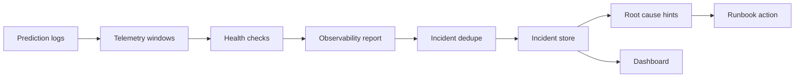

# Model Observability + Incident Response Platform

A production-style model reliability project that detects feature drift, prediction drift, serving SLO failures, freshness issues, and data quality problems, then creates idempotent incidents with severity, likely root cause, and next action guidance.

The default demo is local-first and dependency-light. The design maps cleanly to Evidently, Prometheus, OpenTelemetry, Grafana, PagerDuty, and warehouse-backed model monitoring.


## What This Demonstrates

- Reference and current telemetry windows
- Feature drift checks
- Prediction distribution drift checks
- Latency p95 and p99 tracking
- Error rate monitoring
- Freshness checks
- Data quality checks
- Idempotent incident creation
- Severity classification
- Likely root-cause hints
- Runbook-oriented next actions
- Dashboard for health checks, incidents, and feature shifts

## Architecture



## Quick Start

```bash
make demo
make test
```

Open the generated dashboard:

```bash
open .local/reports/model_observability_dashboard.html
```

## Checks

- `feature_drift`: compares current feature means to reference means
- `feature_drift PSI`: compares distribution shift across reference quantile buckets
- `prediction_drift`: compares current and reference score means
- `latency_slo`: validates p95 latency
- `error_rate`: validates serving failure rate
- `null_rate`: checks malformed telemetry
- `freshness`: checks telemetry recency

## Production-Grade Refinements

See [production-grade refinements](docs/production-grade-refinements.md) for the PSI drift, SLO, incident dedupe, root-cause, and runbook improvements.

## Incident Semantics

Incidents are deduplicated by a stable fingerprint derived from the failed check and observed signature. Running the same report repeatedly does not create duplicates. Each incident includes:

- incident ID
- severity
- check name
- observed value
- root cause hint
- next action
- status

## Production Mapping

| Local artifact | Production analogue |
| --- | --- |
| `.local/data/reference.csv` | warehouse baseline window |
| `.local/data/current.csv` | live serving telemetry window |
| `.local/reports/observability_report.json` | Evidently or custom monitoring report |
| `.local/incidents/incidents.jsonl` | incident management table |
| `contracts/observability_policy.yml` | monitoring policy as code |

## Interview Talking Points

- Why drift and latency need separate root-cause paths.
- How to avoid duplicate alerts during repeated monitor runs.
- How to choose thresholds for early warning versus paging.
- Why prediction drift without feature drift suggests model or calibration issues.
- How to connect model incidents to serving traces and upstream data changes.
