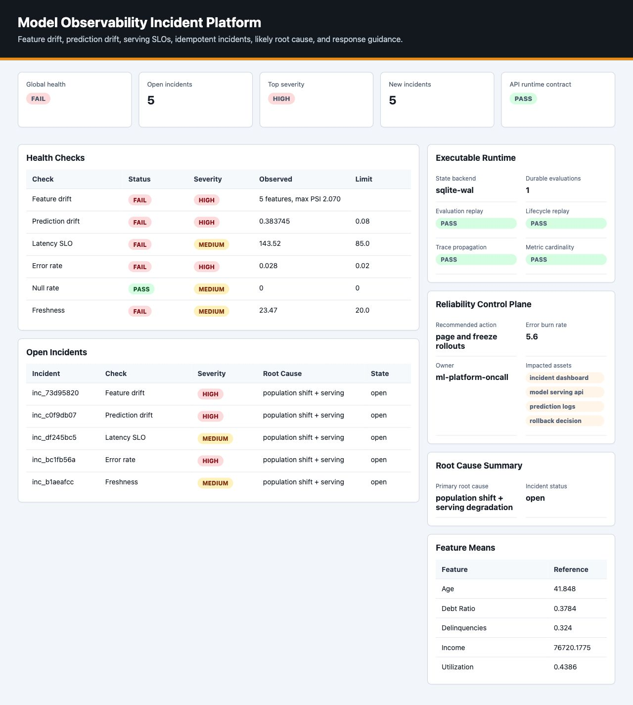
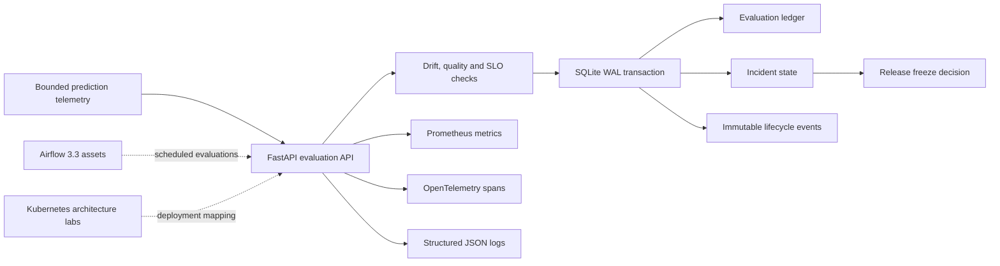

# Model Observability Incident Platform

[](https://github.com/kevinmeix1/model-observability-incident-platform/actions/workflows/ci.yml)

A local-first, production-style reliability control plane that evaluates model
telemetry, opens durable incidents, freezes unsafe releases, and records
recovery evidence.

This is a portfolio project, not a production service. It uses deterministic
synthetic telemetry and a single-process SQLite runtime so its correctness and
failure behavior can be reviewed without cloud credentials.



## What Is Executable

| Capability | Local evidence | Integrated evidence | Production mapping |
| --- | --- | --- | --- |
| Drift and serving checks | Deterministic reference/current windows and six check types | FastAPI accepts bounded telemetry windows | Warehouse or stream telemetry consumers |
| Incident state | SQLite WAL transaction with incidents, evaluations, and immutable events | Restart-safe HTTP idempotency smoke | Postgres with retention and HA |
| Incident lifecycle | Open, acknowledge, resolve, reopen, and recovery hysteresis | Optimistic version and transition-key tests | On-call authorization and ticket integration |
| Metrics | Dedicated Prometheus registry with bounded labels | `/metrics` is checked over HTTP | Managed Prometheus and recording rules |
| Traces | Manual OpenTelemetry server/evaluation spans | W3C `traceparent` propagation test | OTLP collector and trace backend |
| API image | Non-root, read-only filesystem, body and concurrency limits | Compose health and behavior smoke in CI | Kubernetes Deployment and managed database |
| Airflow | Airflow 3.3 stateful incident DAG and validator | Real Airflow 3.3 SDK parse job in CI | Scheduler, workers, and remote DAG bundles |
| Kubernetes | Versioned manifests and decision reports | Static contract tests | Minikube or managed-cluster deployment work |

An image, dependency, or manifest is not counted as an integration merely
because it exists in the repository.

## Architecture



Solid lines are exercised locally or in the container smoke. Dashed lines are
integration designs and SDK/manifests, not a claim of a running cluster.

## Quick Start

The dependency-free deterministic demo still works with the standard library:

```bash
make demo
make test
open .local/reports/model_observability_dashboard.html
```

Exercise the actual HTTP runtime with Python 3.12:

```bash
python3.12 -m venv .venv
.venv/bin/python -m pip install --upgrade "pip==25.3"
.venv/bin/python -m pip install \
  --constraint requirements-observability.lock \
  -e ".[runtime]" "httpx2==2.5.0" "ruff==0.15.21"

make test-api PYTHON=.venv/bin/python
make runtime-contract PYTHON=.venv/bin/python
make dashboard PYTHON=.venv/bin/python
```

Start the API at `http://127.0.0.1:8081`:

```bash
make api-run PYTHON=.venv/bin/python
```

Useful endpoints:

- `POST /v1/evaluations`
- `GET /v1/incidents`
- `POST /v1/incidents/{id}/acknowledge`
- `POST /v1/incidents/{id}/resolve`
- `GET /v1/incidents/{id}/events`
- `GET /v1/runtime`
- `GET /health/ready`
- `GET /metrics`
- `GET /docs`

## Container Path

```bash
make compose-config
make compose-smoke PYTHON=.venv/bin/python
```

The Compose topology uses a finite state initialization job, a health-gated
control-plane service, a named state volume, and an optional Prometheus profile.
The application runs as UID/GID 65532 with dropped capabilities, no privilege
escalation, a read-only root filesystem, bounded memory/CPU/PIDs, and graceful
termination.

Prometheus is optional:

```bash
make compose-observability-up
```

The runtime deliberately uses one Uvicorn worker. In-memory metric aggregation
and SQLite write serialization would make a multi-worker claim misleading.

## Incident Semantics

### Evaluation idempotency

`evaluation_id` is stored with a canonical request hash. Replaying the same ID
and payload returns the original decision without incrementing incidents. Reuse
with a different payload returns HTTP 409.

### Stable deduplication

An incident fingerprint contains model name, model version, policy version, and
check name. Observed values are evidence, not identity. Repeated failures update
one incident and increment its occurrence count.

### Lifecycle concurrency

Acknowledgement and resolution require an expected incident version and a
transition idempotency key. A stale version or reused key with a different
payload returns HTTP 409. Every accepted state change appends an audit event.

### Recovery hysteresis

One healthy window records recovery evidence. Two consecutive healthy windows
auto-resolve an active incident by default. A later failed window reopens it.
High or critical active incidents produce a release-freeze decision.

## Checks

| Check | Signal | Demo threshold |
| --- | --- | ---: |
| Feature drift | Mean shifts and PSI across five features | PSI `>= 0.20` or feature-specific delta |
| Prediction drift | Current versus reference mean score | Absolute delta `> 0.08` |
| Latency SLO | Current p95 and p99 | p95 `> 85 ms` |
| Error rate | Non-success telemetry | `> 2%` |
| Null rate | Missing monitored feature values | Any missing value |
| Freshness | Age of newest current telemetry | `> 20 minutes` |

These values make the scenario deterministic. They are policy examples, not
validated thresholds for a real credit-risk model.

## Observability Contract

The API emits:

- low-cardinality counters, gauges, and histograms under the
  `model_observability_` prefix
- HTTP server spans named from route templates, never raw incident IDs
- a nested `model_observability.evaluate` span
- W3C trace propagation through `traceparent`
- JSON logs with request and trace IDs, route, status, duration, and bounded
  outcome fields

Evaluation IDs, request IDs, incident IDs, model versions, raw features, and
telemetry records are intentionally excluded from metric labels. Raw features
and request bodies are also excluded from logs and spans.

## Airflow And Kubernetes Scope

The repository includes a real Airflow 3.3 SDK parse contract for stateful
incident orchestration. It also contains architecture labs for Kueue admission,
multi-cluster dispatch, Dynamic Resource Allocation, workload identity,
progressive delivery, resource controls, chaos, and policy enforcement.

Those assets demonstrate design judgment and are grouped in the generated
artifact index. They are not all deployed together, and several target recent
or preview Kubernetes capabilities that require explicit feature-gate and
version checks.

Start with these documents:

- [Executable observability runtime](docs/executable-observability-runtime.md)
- [Runtime incident recovery runbook](docs/runbooks/runtime-incident-recovery.md)
- [Airflow 3.3 stateful orchestration](docs/airflow-stateful-orchestration.md)
- [Semantic telemetry contract](docs/semantic-telemetry.md)
- [Release admission control](docs/release-admission-control.md)
- [Kubernetes and Airflow robustness](docs/kubernetes-airflow-robustness.md)

## Commands

| Command | Evidence produced |
| --- | --- |
| `make demo` | Dependency-free telemetry, incidents, plans, reports, and dashboard |
| `make test` | Legacy deterministic domain and manifest contracts |
| `make test-api` | API, state, trace, metric, and lifecycle tests |
| `make runtime-contract` | In-process end-to-end HTTP evidence JSON |
| `make api-smoke` | The same contract against a running API |
| `make lint-runtime` | Ruff checks for the executable runtime boundary |
| `make dashboard` | Dashboard rebuilt from current static and runtime evidence |
| `make airflow-sdk-contract` | Airflow 3.3 DAG parse and task contract |
| `make compose-smoke` | Container build, readiness, and real HTTP behavior |
| `make ci-verify` | Generated dependency-free artifact inventory |

## Test Evidence

The runtime suite proves:

- point-in-time freshness uses an injected, timezone-aware clock
- evaluation replay survives application restart
- stable fingerprints update evidence without duplicate incidents
- transition keys are idempotent and incident versions are optimistic
- two healthy windows resolve an incident and later failures can reopen it
- request schemas, record counts, model versions, and body sizes are bounded
- W3C traces preserve the incoming trace ID and use low-cardinality routes
- Prometheus output does not contain evaluation, request, or model-version IDs

CI separates the dependency-free demonstration, Airflow 3.3 SDK parse, and
executable runtime/container contract so each claim has a visible gate.

## Production Boundary

Before operating this as a real service, it would need:

- authenticated callers and role-based incident transitions
- Postgres or another HA transactional store with migrations and retention
- tenant isolation and per-model policy ownership
- streaming or warehouse ingestion rather than request-carried windows
- calibrated thresholds, delayed-label evaluation, and business SLOs
- alert delivery, escalation policy, and ticket-system reconciliation
- multi-replica metric aggregation and safe leader or worker coordination
- privacy review, deletion policy, audit retention, backups, and restore drills
- load, soak, failure, and adversarial testing with representative telemetry

The local SQLite boundary is intentional: it makes transaction and recovery
semantics inspectable without pretending to solve distributed consensus.

## Interview Talking Points

- Why observed values must not be part of an incident deduplication key.
- Where the evaluation, incident update, and audit event transaction begins and
  ends.
- Why idempotency keys and optimistic versions solve different retry problems.
- Why recovery requires multiple healthy windows rather than one green sample.
- How metric cardinality and trace route naming affect observability cost.
- Why a single-worker SQLite deployment is honest locally but not horizontally
  scalable.
- Which Airflow/Kubernetes assets are executed, parsed, statically tested, or
  design-only.
