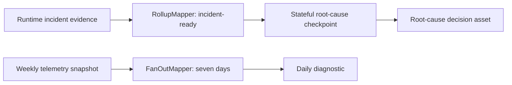

# Airflow 3.3 Stateful Incident Orchestration

This refinement applies Airflow 3.3 state stores, partition mappers, runtime partitioning, and exception-aware retries to model incident workflows. CI parses the DAG module against `apache-airflow==3.3.0`; the repository remains a production-style portfolio implementation rather than an operated incident platform.

## Implemented Evidence

- Runtime freshness, drift, and SLO evidence rolls up into one root-cause decision.
- A weekly telemetry snapshot fans out to seven independently retryable daily diagnostics.
- Task state preserves the incident operation ID and diagnostic progress across worker retries.
- Asset state preserves the incident fingerprint and observed route generation across runs.
- CI installs constrained Airflow, runs `pip check`, imports expected DAGs, calls `DAG.validate()`, and rejects empty DAGs.



## State Boundaries

| Mechanism | Stored | Why |
| --- | --- | --- |
| Task state store | incident operation ID and progress | avoid duplicate incident actions after worker failure |
| Asset state store | incident fingerprint and route generation | keep root-cause and rollout-freeze evidence stable across runs |
| Telemetry/evidence stores | raw logs, metrics, reports, payloads | retain queryability and privacy controls outside Airflow metadata |

Only the idempotency-critical operation ID uses `NEVER_EXPIRE`. Raw telemetry and incident evidence never enter the state store.

## Failure Semantics

- Warehouse, Prometheus, and Kubernetes connection failures retry with bounded delay.
- Rollout-freeze authorization failures fail fast and page an operator.
- The persisted fingerprint prevents duplicate incident actions.
- The stored route generation prevents a retry from explaining a different rollout state.
- Fanout is capped at seven diagnostics and rollup at one root-cause run.

## Verification

```bash
make airflow-stateful-orchestration
make airflow-sdk-contract
```

The SDK contract command requires the `airflow33` optional dependency. CI uses Airflow's official Python 3.11 constraints.

## Production Boundary

The local demo does not run Airflow, Prometheus, an alert router, or a live Kubernetes release. The CI gate proves authoring compatibility, not alert delivery or rollout-freeze mutation. A production test would exercise scheduler failover, delayed telemetry, duplicate events, retention cleanup, and incident-system reconciliation.

References: [state-store overview](https://airflow.apache.org/docs/apache-airflow/stable/core-concepts/task-and-asset-state-store.html), [asset partitioning](https://airflow.apache.org/docs/apache-airflow/stable/authoring-and-scheduling/assets.html), [retry policies](https://airflow.apache.org/docs/apache-airflow/stable/core-concepts/tasks.html#retry-policies), and [constrained installation](https://airflow.apache.org/docs/apache-airflow/stable/installation/installing-from-pypi.html).
