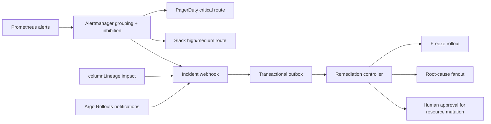

# Alert Routing And Guarded Remediation

This feature models the incident-response layer that sits between raw alerts and action. The goal is to reduce alert noise, route the highest-impact signal to the right receiver, and keep remediation safe by separating automatic read-only actions from guarded resource mutations.

## What It Demonstrates

- Alertmanager grouping by domain, root cause, and model version.
- Inhibition rules that suppress downstream symptoms when a stronger root-cause alert is active.
- Critical drift escalation to paging plus rollout freeze automation.
- Argo Rollouts notification templates for analysis failure, rollout pause, and evidence attachment.
- Guarded remediation admission for resource-changing actions.
- Column-level lineage impact using an OpenLineage-style `columnLineage` facet.

## Demo Commands

```bash
make alert-routing-remediation
make demo
make ci-verify
```

Generated evidence:

```text
.local/reports/alert_routing_remediation_plan.json
.local/reports/model_observability_dashboard.html
```

## Architecture



## Remediation Policy

Automatic remediation is limited to bounded, reversible, or read-only actions:

- freeze rollout traffic movement
- launch root-cause diagnostics
- republish the dashboard

Resource-increasing remediation is guarded by a human approval gate. This prevents the incident system from making a degraded cluster worse by expanding diagnostic workers during a capacity incident.

## Production Notes

Alertmanager handles grouping, routing, silencing, and inhibition; this project encodes those concepts as deterministic local evidence. In production, the same policy would be backed by real receivers, Kubernetes RBAC, release admission, and audit logs.
