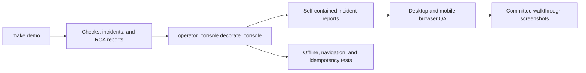

# SignalOps Operator Console

The generated UI is an offline incident desk for model reliability. It prioritizes failed checks, durable incidents, root-cause evidence, downstream impact, and guarded recovery over decorative monitoring panels.

## Design contract

- **Identity:** SignalOps uses graphite, incident red, lineage teal, and escalation amber. Color is reserved for severity, ownership, or intervention.
- **Shape:** status cells share one frame and incident surfaces use matte rules with minimal radius and no decorative shadows.
- **Density:** checks, incidents, lineage, and routing evidence are compact enough for an on-call review while retaining readable labels.
- **Language:** the UI describes current incident state and response controls. Interview guidance is kept outside the runtime screen.
- **Offline behavior:** all CSS and Lucide-derived SVG paths are embedded by Python, with no CDN, tracking, or framework runtime.
- **Accessibility:** skip navigation, landmarks, active-route semantics, focus-visible controls, reduced-motion handling, and responsive overflow checks are tested.

## Information architecture

| Surface | Operational question |
| --- | --- |
| Incident desk | What is broken, how severe is it, and is the release frozen? |
| Reliability review | Is the incident backed by durable and complete evidence? |
| Response drill | Can the team detect, route, contain, recover, and fence stale work? |
| Signal topology | How do OTel signals, Airflow assets, lineage, SLO burn, and Kueue capacity connect? |
| Demo runbook | What is the timed sequence for reviewing one incident? |
| Evidence register | Which immutable artifact supports each response decision? |

## Open-source references

- [Tabler](https://docs.tabler.io/) (MIT) for application-shell anatomy and compact operational components.
- [PatternFly dashboard guidance](https://v5-archive.patternfly.org/patterns/dashboard/design-guidelines/) and [table guidance](https://v4-archive.patternfly.org/v4/components/table/design-guidelines/) for incident hierarchy and dense tables.
- [Grafana dashboard guidance](https://grafana.com/docs/grafana/latest/visualizations/dashboards/build-dashboards/best-practices/) for constrained panels and explicit dashboard intent.
- [Lucide](https://github.com/lucide-icons/lucide) (ISC) for inline navigation and refresh icon paths.

No upstream template CSS or runtime assets are copied. The incident-oriented shell and visual hierarchy are original to this repository.

## Review checklist

1. Run `make demo` and open `.local/reports/model_observability_dashboard.html`.
2. Verify all six navigation destinations preserve the shell and active state.
3. Check desktop at 1440px and mobile at 390px with no horizontal document overflow.
4. Confirm severity, root cause, lineage impact, and recovery state are never encoded by color alone.
5. Regenerate the six `study-*` screenshots after any layout or copy change.
