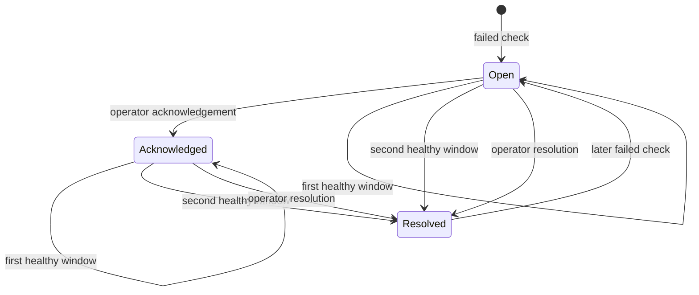

# Executable Observability Runtime

## Purpose

The runtime turns the repository's model-monitoring logic into a reviewable
control-plane service. It accepts bounded reference and current telemetry
windows, evaluates six checks, updates incident state transactionally, and
returns a release decision.

It is intentionally separate from the model-serving path. The serving service
produces telemetry; this service consumes telemetry and owns reliability state.

## Request Contract

`POST /v1/evaluations` requires:

- a caller-supplied evaluation idempotency key
- the fixed model service name `credit-risk-router`
- one bounded model and policy version
- 20 to 2,000 records in each telemetry window
- timezone-aware event timestamps
- required, nullable monitored features with numeric bounds
- no undeclared fields

Every record must carry the requested model version. This prevents a single
evaluation from silently mixing deployments.

The request body is limited before validation. Evaluation concurrency is also
bounded, with a short queue timeout and HTTP 503 plus `Retry-After` on overload.
Incident listings and event histories also require bounded limits; the runtime
summary uses SQL aggregates rather than truncating operational counts.

## Transaction Boundary

One `BEGIN IMMEDIATE` SQLite transaction covers:

1. evaluation idempotency recheck
2. incident create, evidence update, or reopen
3. recovery-streak update or auto-resolution
4. immutable incident-event append
5. release decision calculation
6. evaluation response persistence

The API does not return success before this transaction commits. A failed
transaction cannot leave an incident without its audit event or an evaluation
without its stored response.

SQLite runs in WAL mode. WAL allows readers and a writer to make progress with
less interference, but SQLite still serializes writers. That is why the local
image uses one Uvicorn worker and why horizontal scaling requires a database
migration. See the [SQLite WAL documentation](https://www.sqlite.org/wal.html).

## Idempotency And Concurrency

Evaluation and transition keys solve different retry boundaries:

| Boundary | Key | Conflict behavior |
| --- | --- | --- |
| Evaluation | `evaluation_id` plus canonical payload hash | Same payload replays; changed payload returns 409 |
| Incident transition | `transition_id` plus canonical transition hash | Same transition replays; changed payload returns 409 |
| Incident write | Stable model, policy, and check fingerprint | Repeated failures update evidence and occurrence count |
| Operator concurrency | `expected_version` | Stale acknowledge or resolve returns 409 |

Observed drift or latency values are not part of the incident fingerprint. If
they were, ordinary measurement movement would create alert storms instead of
updating one operational problem.

## Recovery Model

The default recovery threshold is two consecutive healthy evaluations:

This hysteresis avoids clearing an incident after one favorable sample. A
production policy would tune the count and cadence by signal, severity, and
business impact.

## Metrics

The service owns a dedicated Prometheus registry so tests and embedded runtimes
do not leak global process collectors into one another. Metrics use the
`model_observability_` prefix, seconds for durations, ratios for PSI, and
timestamps rather than "time since" values.

Labels are limited to fixed route templates, HTTP status class, known check
names, known features, outcomes, transitions, and severity. Evaluation,
request, incident, customer, and model-version identifiers are excluded.

This follows Prometheus guidance on
[metric naming and base units](https://prometheus.io/docs/practices/naming/) and
avoids unbounded label cardinality.

## Tracing

The application installs the OpenTelemetry SDK, creates a service resource,
and emits:

- one server span per HTTP request
- one nested `model_observability.evaluate` span
- stable route-template names such as `POST /v1/evaluations`
- W3C trace propagation through the default propagator
- error status and exception records for unhandled failures

The bounded in-memory exporter exists only for contract tests. An OTLP/HTTP
exporter can be enabled with `OTEL_EXPORTER_OTLP_TRACES_ENDPOINT`.

OpenTelemetry's Python guidance distinguishes application instrumentation,
which needs the SDK, from library instrumentation, which may use only the API.
The implementation follows the
[manual instrumentation guide](https://opentelemetry.io/docs/languages/python/instrumentation/).
HTTP span names and attributes follow the stable
[HTTP semantic conventions](https://opentelemetry.io/docs/specs/semconv/http/http-spans/):
dynamic incident IDs never appear in span names or `http.route`.

## Structured Logs

Each request log contains UTC time, level, event, request ID, trace ID, method,
route template, status, and duration. Evaluation logs add only outcome and
incident-change count.

Request bodies, raw features, model scores, customer identifiers, evaluation
IDs, and incident evidence are deliberately omitted.

## Container Controls

The image and Compose topology use:

- Python 3.12.13 and an exact runtime constraints file
- non-root UID/GID 65532
- read-only root filesystem and writable named state volume
- dropped Linux capabilities and `no-new-privileges`
- memory, CPU, and PID limits
- finite state initialization with `service_completed_successfully`
- readiness-gated startup and graceful SIGTERM handling
- optional Prometheus profile rather than a mandatory observability stack

## Verification

`tests/test_observability_api.py` and
`tools/smoke_observability_api.py` prove the following independently:

- persistence across application restart
- stable incident deduplication
- evaluation and transition replay
- optimistic lifecycle concurrency
- recovery hysteresis
- schema and body bounds
- W3C trace propagation
- low-cardinality metric output
- readiness and runtime metadata

GitHub Actions repeats the smoke against the built container. Local Docker
verification is not claimed on machines where Docker is unavailable.

## Production Migration

Move to Postgres when any of these become true:

- more than one API replica is required
- sustained concurrent writes exceed the bounded local workload
- online schema migrations must occur without downtime
- tenant isolation or row-level access control is required
- audit retention and backup policy exceed local-volume guarantees

The migration should preserve evaluation hashes, incident fingerprints,
transition keys, versions, and event ordering. Those are domain contracts, not
SQLite implementation details.
