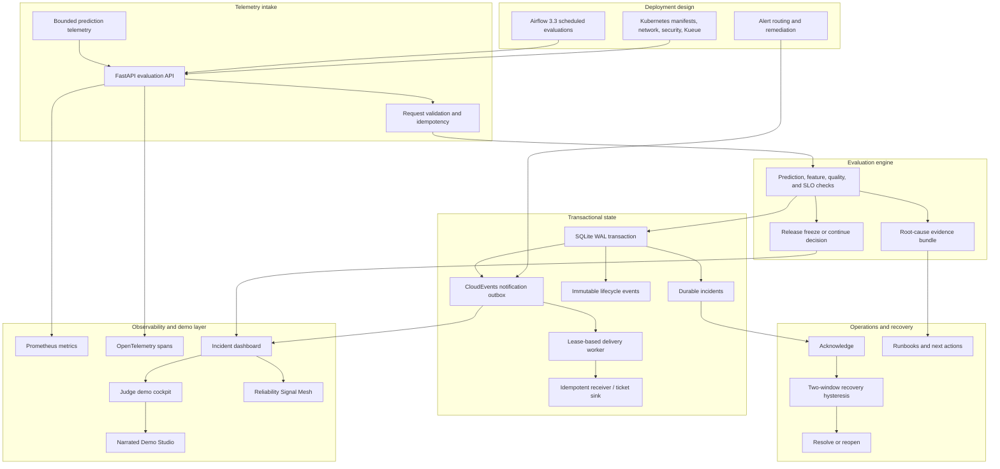

# Study Guide: Model Observability Incident Platform

This guide explains the full reliability control plane, the demo screenshots, and the production incident-management concepts demonstrated by the project.

## Full Architecture



The central idea: observability should create durable operational state and release decisions, not just dashboards.

## Screenshot Walkthrough

Fresh full-page captures from the generated app are available as a linear demo path:

| Step | Screenshot | What it proves |
| --- | --- | --- |
| 0 | `docs/screenshots/study-00-artifact-index.png` | The generated artifact index gives reviewers one launch point. |
| 1 | `docs/screenshots/study-01-main-dashboard.png` | The incident dashboard is readable end to end. |
| 2 | `docs/screenshots/study-02-judge-cockpit.png` | The portfolio cockpit groups evidence by reviewer intent. |
| 3 | `docs/screenshots/study-03-operator-drill.png` | Incident response is rehearsed as an operator workflow. |
| 4 | `docs/screenshots/study-04-reliability-signal-mesh.png` | Observability signals are connected to release decisions. |
| 5 | `docs/screenshots/study-05-narrated-demo-studio.png` | The narration and video plan can be reviewed without running tools. |

1. **Incident dashboard**: `docs/screenshots/dashboard.png`
   Shows active incidents, release freeze state, check failures, runtime health, and incident lifecycle controls.

2. **Recovered release**: `docs/screenshots/dashboard-recovery.png`
   Demonstrates two healthy windows, auto-resolution, and returning the release decision to continue.

3. **Notification delivery**: `docs/screenshots/dashboard-delivery.png`
   Shows CloudEvents outbox state, delivery attempts, retries, and drained notification evidence.

4. **Root-cause evidence**: `docs/screenshots/dashboard-root-cause-evidence.png`
   Explains likely cause, confidence, symptoms, affected assets, and missing evidence.

5. **Alert routing and remediation**: `docs/screenshots/dashboard-alert-routing-remediation.png`
   Shows grouping, inhibition, escalation, approval gates, and remediation commands.

6. **Alert routing triage**: `docs/screenshots/dashboard-alert-routing-triage.png`
   Presents the operator view for deciding ownership, severity, and next action.

7. **Judge demo cockpit**: `docs/screenshots/dashboard-judge-cockpit.jpg`
   The best first screen for reviewers because it links the dashboard, evidence, runbooks, and demo narration.

8. **Operator drill lab**: `docs/screenshots/dashboard-operator-drill.png`
   Walks through detection, acknowledgement, remediation, recovery, and postmortem evidence.

9. **Reliability Signal Mesh**: `docs/screenshots/dashboard-reliability-signal-mesh.png`
   Connects Airflow assets, SLO burn, telemetry, release admission, and incident evidence.

10. **Narrated Demo Studio**: `docs/screenshots/dashboard-narrated-demo-studio.png`
    Provides timed narration, subtitles, Remotion props, and natural voice generation options.

## How To Study The Code

| Area | Files | What to learn |
| --- | --- | --- |
| Runtime API | `api.py`, `runtime_state.py`, `runtime_contract.py` | Bounded telemetry, idempotent evaluation, health, metrics |
| Incident model | `incidents.py`, `checks.py`, `reliability_control.py` | Stable fingerprints, lifecycle transitions, recovery hysteresis |
| Notifications | `notification_dispatch.py`, `notification_worker.py` | Transactional outbox, leases, retries, DLQ-ready delivery |
| RCA and runbooks | `root_cause_evidence.py`, `alert_routing_remediation.py`, `runbooks/runtime-incident-recovery.md` | Evidence-driven triage and response |
| Demo layer | `dashboard.py`, `demo_cockpit.py`, `narrated_demo_studio.py`, `artifact_index.py` | How incident evidence becomes a teachable operator console |

## Commands To Reproduce

```bash
make demo
make test
make ci-verify
open .local/reports/index.html
open .local/reports/model_observability_dashboard.html
open .local/reports/narrated_demo_studio.html
```

To exercise the runtime and outbox contracts:

```bash
make runtime-contract
make notification-outbox-contract
make api-run
```

## Interview Talking Points

- **Incidents need stable identity.** Fingerprints use model, version, policy, and check name. Observed values are evidence, not identity.
- **Evaluation must be idempotent.** Replaying the same `evaluation_id` and payload returns the same decision; reusing the ID with a different payload conflicts.
- **Notifications belong in the transaction.** A CloudEvents outbox prevents an incident from committing without a corresponding delivery record.
- **Recovery needs hysteresis.** One healthy window is evidence; two consecutive healthy windows resolve by policy.
- **RCA should be evidence-scored.** The platform states likely cause, confidence, affected assets, and missing evidence instead of pretending certainty.

## Learning Outcomes

After studying this repository, you should be able to explain model drift incident management, durable incident state, release-freeze automation, transactional notifications, OpenTelemetry/Prometheus evidence, recovery hysteresis, and how to build an observability system that drives action rather than merely displaying charts.
