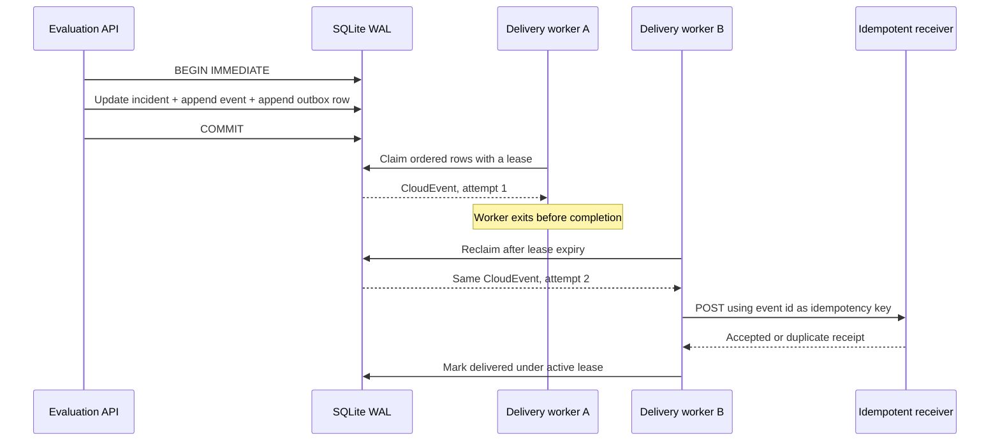

# Transactional Incident Notification Outbox

## Decision

Every accepted incident lifecycle change appends three records in one SQLite
transaction:

1. the current incident state,
2. the immutable incident event,
3. a CloudEvents-compatible notification in `notification_outbox`.

The API never performs a database write followed by an inline webhook call.
That would be a dual write: either side could succeed while the other fails.
The local design follows the transactional outbox pattern described by
[AWS Prescriptive Guidance](https://docs.aws.amazon.com/prescriptive-guidance/latest/cloud-design-patterns/transactional-outbox.html).

## Executed Contract

`make notification-outbox-contract` proves:

- an incident transaction creates its outbox event atomically;
- event envelopes contain CloudEvents `specversion`, `id`, `source`, `type`,
  `subject`, `time`, and `data` fields;
- two workers receive disjoint claims;
- only the earliest non-terminal event for an incident can be claimed;
- an expired lease can be reclaimed and the old worker is fenced;
- failed delivery persists exponential backoff and an immutable attempt result;
- successful replay is harmless at the idempotent receipt sink;
- exhausting the retry budget moves the event to `dead_letter`.

The report is written to
`.local/reports/notification_outbox_contract.json`.

## Event Identity

The event ID is deterministic from `incident_id`, `incident_version`, and
`event_type`. A retry reuses the same ID and payload. CloudEvents defines the
combination of `source` and `id` as the event identity and allows a consumer to
treat a repeated pair as a duplicate. See the
[CloudEvents 1.0.2 specification](https://github.com/cloudevents/spec/blob/v1.0.2/cloudevents/spec.md).

The event data includes incident version, transition, model and policy version,
check, severity, actor, and trace ID. It intentionally excludes prediction
rows and feature values.

## Ordering And Delivery Semantics

Delivery is **at least once**, ordered per `incident_id`, and unordered across
different incidents. Global ordering would serialize unrelated incidents and
reduce throughput without improving their lifecycle correctness.

A row can be claimed when it is:

- `pending` and its `available_at` time has passed, or
- `in_flight` and its lease has expired.

It is claimable only when no earlier non-terminal row exists for the same
incident. A dead-lettered predecessor is terminal and unblocks later versions;
the receiver can detect a version gap and operators retain the failed payload
for replay.

The local dispatcher records every attempt as `in_flight`, `lease_expired`,
`retry_scheduled`, `delivered`, or `dead_letter`. Retry delay is exponential
and capped. A production worker should add bounded jitter to avoid synchronized
retries across replicas.

## Receiver Contract

`SqliteReceiptSink` is an executable local stand-in for a downstream incident
router. It stores `event_id` with a canonical payload hash:

- the same ID and payload returns a replay receipt;
- the same ID with another payload fails closed;
- receipt persistence survives process restart.

`HttpCloudEventSink` sends structured JSON using
`application/cloudevents+json` and the event ID in `Idempotency-Key`. A real
receiver must persist that key before applying side effects.

## Observability

The API exposes bounded outbox gauges by state under
`model_observability_notification_outbox_events`. Event IDs, incident IDs, and
model versions are not metric labels. Read-only inspection endpoints are:

- `GET /v1/notifications`
- `GET /v1/notifications/{event_id}/attempts`

Messaging traces should propagate the message creation context and use producer
and consumer span kinds as described by the current
[OpenTelemetry messaging conventions](https://opentelemetry.io/docs/specs/semconv/messaging/messaging-spans/).
Those conventions are still marked development, so a production rollout must
pin and deliberately migrate the emitted semantic-convention version.

## Local Boundary

SQLite WAL plus `BEGIN IMMEDIATE` gives a clear, reviewable single-writer
contract. It is not a horizontally scalable queue. The Compose service runs one
Uvicorn worker for that reason.

The production migration is:

- Postgres for incident, event, outbox, and attempt tables;
- `SELECT ... FOR UPDATE SKIP LOCKED` for disjoint worker claims;
- a partial index on due, non-terminal rows;
- multiple stateless workers with lease heartbeats and jittered backoff;
- Kafka, SQS, or another durable broker after the outbox relay;
- receiver-side deduplication and incident-version gap detection;
- separate retention for delivered events and dead-letter evidence;
- authenticated worker identity and authorization for replay operations.

This project demonstrates the state transitions and recovery reasoning. It does
not claim exactly-once delivery or a production messaging deployment.
